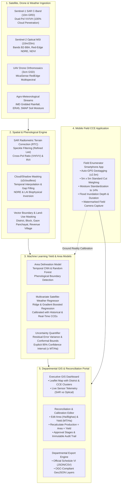

# Technical Architecture Blueprint

**Platform:** GeoAgri-Assam (NESFIC-D-12)  
**Entities:** Assam State Space Applications Centre (ASSAC) & Directorate of Agriculture, Govt. of Assam

---

## 1. High-Level System Architecture

---

## 2. Mathematical Formulations

### 2.1 Standardized Crop Cutting Experiment (CCE) Yield Formula
In the field application, enumerators measure fresh cut biomass in a standardized 5m $\times$ 5m ($25\text{ m}^2$) quadrant. The ground truth dry yield normalized to standard 14% storage moisture is calculated as:

$$\text{Raw Yield (MT/Ha)} = \left(\frac{\text{Fresh Cut Biomass (kg)}}{\text{Plot Area (m}^2)}\right) \times \frac{10{,}000\text{ m}^2}{1{,}000\text{ kg}} = \frac{\text{Biomass (kg)}}{25} \times 10$$

$$\text{Moisture Adjustment Factor} = \frac{100 - \text{Measured Moisture \%}}{100 - 14.0}$$

$$\text{Standardized Yield (MT/Ha)} = \text{Raw Yield} \times \text{Moisture Adjustment Factor}$$

Conversion to Assamese Bighas ($1\text{ Hectare} \approx 7.47\text{ Bighas}$):
$$\text{Yield (kg/Bigha)} = \frac{\text{Yield (MT/Ha)} \times 1{,}000}{7.47}$$

### 2.2 Satellite-Agrometeorological ML Yield Formulation
The multivariate regressor predicts crop yield $\hat{Y}$ per pixel and plot using standardized features:
$$\hat{Y} = w_0 + \sum_{i=1}^{M} w_i \left(\frac{x_i - \mu_i}{\sigma_i}\right)$$

Where the features include:
1. $x_1$: Sentinel-1 SAR VH backscatter in dB ($\sigma^0_{VH}$ biomass volume scattering, weight: $+0.2618$)
2. $x_2$: Sentinel-1 SAR VV backscatter in dB ($\sigma^0_{VV}$ surface/soil interaction, weight: $+0.0860$)
3. $x_3$: SAR cross-polarization ratio ($\sigma^0_{VH} - \sigma^0_{VV}$, weight: $+0.1455$)
4. $x_4$: Sentinel-2 Optical NDVI (Canopy greenness, weight: $+0.2467$)
5. $x_5$: Sentinel-2 Optical NDRE (Red-Edge Chlorophyll vigor, weight: $+0.1305$)
6. $x_6$: IMD gridded cumulative rainfall anomaly (weight: $-0.0340$)
7. $x_7$: Flood inundation duration in days (Damage penalty, weight: $-0.4673$)

### 2.3 Explicit 95% Confidence Interval (CI) Formulation
Every yield estimate outputs bounded uncertainty:
$$\text{CI}_{95\%} = \hat{Y} \pm 1.96 \times \text{SE}_{\text{residuals}}$$
In the Assam pilot cohort, $\text{SE} \approx 0.186\text{ MT/Ha}$, yielding an explicit bound of $\pm 0.36\text{ MT/Ha}$.

### 2.4 Total Production Formula
$$\text{Total Production (MT)} = \text{Estimated Area (Ha)} \times \text{Forecast Yield (MT/Ha)}$$

---

## 3. Technology Stack & Component Architecture

### 3.1 Frontend (`Yield-Frontend`)
* **Framework:** Next.js 14 (React 18, App Router)
* **GIS Mapping:** Leaflet.js with OpenStreetMap and CARTO Voyager tiles
* **Charts & Telemetry:** Chart.js, Lucide Icons, FontAwesome 6
* **Language:** TypeScript
* **State Management:** React hooks with optimistic local UI updates and instant REST synchronization

### 3.2 Backend (`Yield-Backend`)
* **Framework:** FastAPI (Python 3.12+)
* **Server Runtime:** Uvicorn (ASGI)
* **Data Validation:** Pydantic v2
* **Numerical Computing & ML:** NumPy, Scikit-learn
* **Documentation:** OpenAPI Swagger UI (`/docs`) and ReDoc (`/redoc`)
